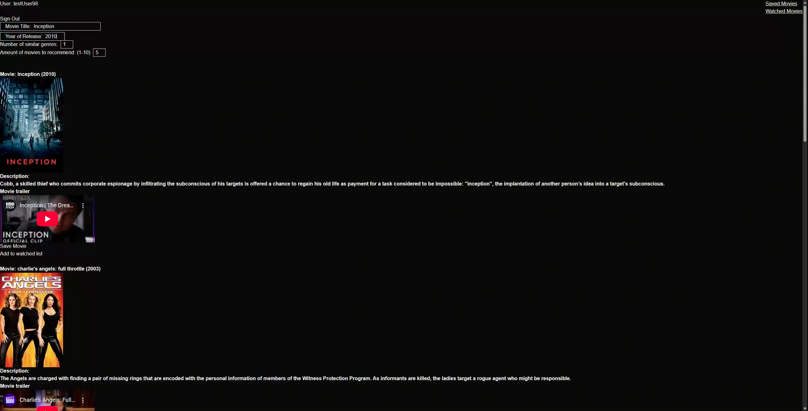

Uses the MovieLens dataset to train the model
Uses TMDB api to get movie information (https://www.themoviedb.org/)

movie_rec_ui contains next.js

Everythinge else
is django

A movie recommendation web app that is powered by a pytorch neural network. 

The pre-trained model is launched on google cloud via a docker image and activates per request, so first request may take some time.

Features:
- Input movie name and year of release, along with amount of movies you want recommended and how many similar genres you want the recommended movies to have with the chosen movie

- Create a watched list of movies to keep track of what you have already watched

- Save movies to watch in the future

