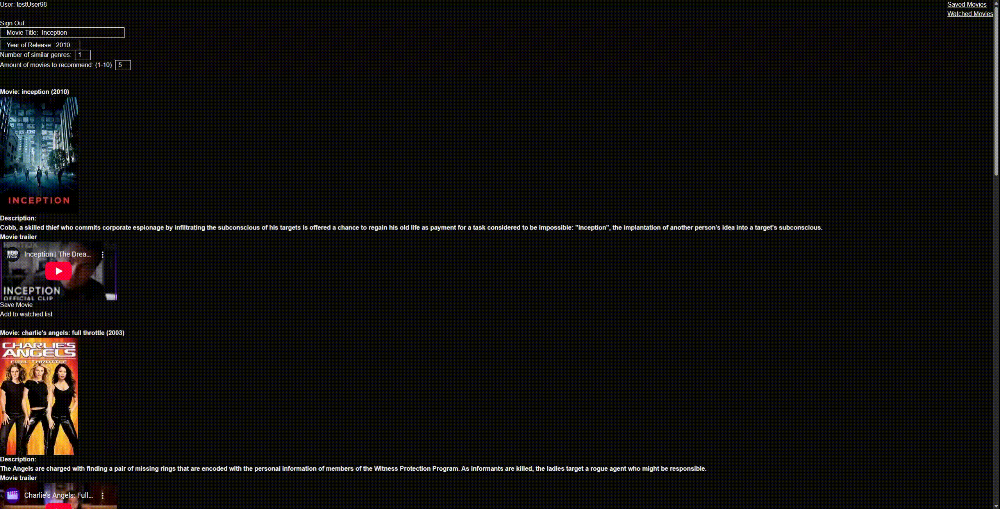

Uses the MovieLens dataset to train the model, then uses TMDB api to get movie information (https://www.themoviedb.org/)

movie_rec_ui contains next.js

Everythinge else
is django

A movie recommendation web app

First request may take some time due to the container being configured to have a cold start.

Features:

- Recommends movies along with their descriptions and a trailer to preview the movie.

- Create a watched list of movies to keep track of what you have already watched.

- Save movies to watch in the future.

